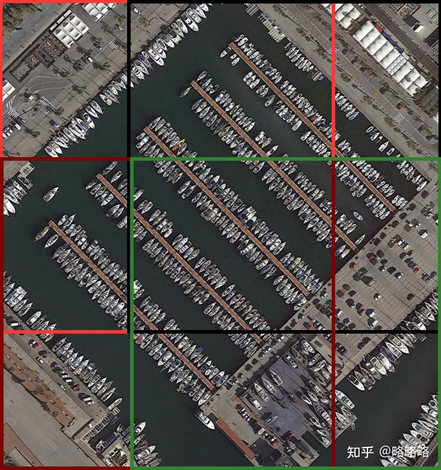
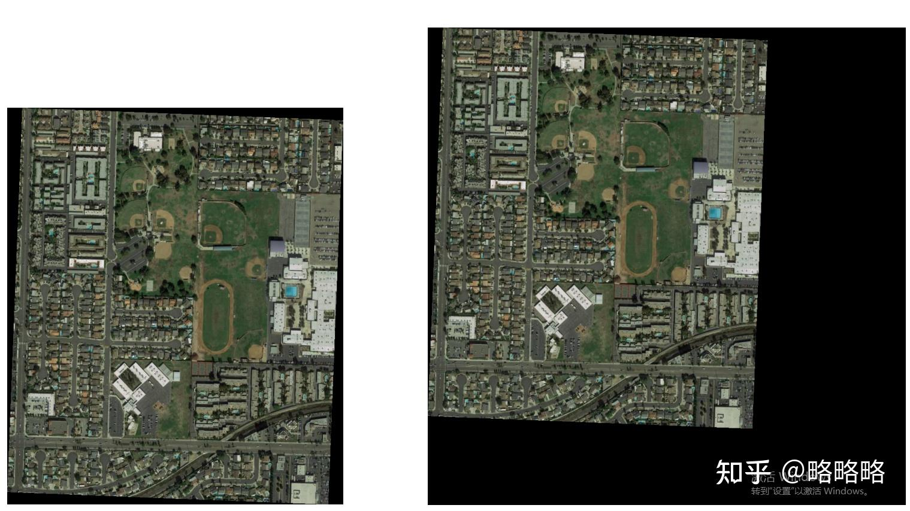
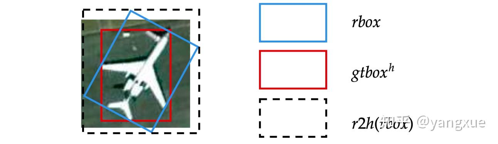

# tools工具脚本
* `analyze`: 数据集分析脚本
  * `statistics_classnames.py`: 统计数据集的类别名称，支持coco、pascalvoc、yolo、dota格式
* `convert`: 数据集格式转化
  * `csv2dota.py`: csv标签文件转dota格式
  * `coco2dota.py`: coco格式转dota格式 
  * `coco2yolo.py`: coco格式转yolo格式
  * `dota2yolo.py`: dota格式转yolo格式，**选取四边形的最小外接正矩形作为box框**
  * `voc2dota.py`: voc格式转dota格式
  * `voc2yolo.py`: voc格式转yolo格式
  * `yolo2dota.py`: yolo格式转dota格式
  * `fair1m2dota.py`: fair1m格式转dota格式
* `plot`: 画框，将标签文件的内容画到原图上
  * `draw_box_label.py`: 画框，可支持yolo和dota格式
* `split`: 数据集裁切
  * `split_dataset_by_image.py`: 根据图片的路径随机采样拆分数据集，在数据集根目录下生成train.txt、val.txt、trainval.txt和test.txt,其中的每行内容是图片的绝对路径
  * `split_vocdataset.py`: 根据voc标签文件的名称随机采样拆分数据集，在数据集根目录的`ImageSets/Main`文件夹下生成train.txt、val.txt、trainval.txt和test.txt,其中的每行内容是标签文件名称（不带拓展名）
  * cut
    * `dota_gap_split.py`: dota格式数据集裁剪
* `scripts`: 工具一起使用的脚本
  * `plot_csv_dota_label.sh`: 将dota的csv文件转成dota的标签格式，并将标签画到原图上，用于测试集的展示


# 裁剪数据
## DOTA数据集裁剪
`split/cut/dota_gap_split.py`
裁剪的逻辑：先根据缩放因子对图片进行缩放，然后进行裁剪。
参数描述
* `dataset-dir`: 数据集的根目录，必填项
* `gap`: 裁剪时，子图宽和高部分重叠的像素面积，默认值为200
* `subsize`: 子图的像素尺寸，即分辨率，默认值为1024
* `scale`: 原图缩放因子
* `image-dirname`: 数据集根目录下存放图片的文件夹名称，默认值为images
* `label-dirnam`: 数据集根目录下存放标签的文件夹名称，默认值为labelTxt
* `output-path`: 裁剪结果输出的路径，默认值为运行脚本的路径下的split文件夹中
* `save-ext`: 裁剪图片文件保存的拓展名，默认值为.png
* `nosave-empty`: 裁切的图片中可能没有标签，是否不保存空标签的图片和标签文件，默认值为false，即保存空文件
* `workers`: 进程数量，默认值为4

`DOTA_subsize1024_gap200_rate1.0`裁剪
<div align='center'>

</div>
<div align='center'>

</div>

```shell
python split/cut/dota_gap_split.py --dataset-dir path/to/dataset \
                                   --gap 200 \
                                   --subsize 1024 \
                                   --rate 1.0 \
                                   --output-path path/to/output \
                                   --nosave-empty
```

# 数据集标签转化
## coco格式转yolo
脚本目前只支持目标检测数据的格式转化，其他任务的格式转化，如实例分割和关键点，待后续完善。

参数描述
* `dataset-dir`: 数据集的根目录，必填项
* `trainimg-dirname`: 数据集根目录下训练集图片存放的文件夹名称，默认值为train2017
* `valimg-dirname`: 数据集根目录下验证集图片存放的文件夹名称，默认值为val2017
* `trainjson-filename`: 数据集根目录下annotations文件夹中训练集的标签文件名称，默认值为instances_train2017.json
* `valjson-filename`: 数据集根目录下annotations文件夹中验证集的标签文件名称，默认值为instances_val2017.json
* `output-dir`: 数据输出的路径，默认值为None, 即只会移动图片并将生成的yolo标签整合成yolo格式。若指定了路径，则会产生图片复制，增加硬盘空间的占用。

coco2017数据集转yolo
```shell
python convert/coco2yolo.py --dataset-dir path/to/dataset \
                            --trainimg-dirname train2017 \
                            --valimg-dirname val2017 \
                            --trainjson-filename instances_train2017.json \
                            --valjson-filename instances_val2017.json
```
## dota格式转yolo
<div align='center'>

</div>
`数据集根目录下需要提供一个class.txt文件，其中内容为标签的类别名称，一行一个类别名称`, 转化的过程中只会保留class.txt文件中出现
过的标签名称。

参数描述
* `dataset-dir`: 数据集的根目录，必填项
* `image-dirname`: 数据集根目录下存放图片的文件夹名称，默认值为images
* `lable-dirname`: 数据集根目录下存放标签的文件夹名称，默认值为labelTxt
* `difficult-thres`: difficult阈值，大于阈值的标签会杯过滤掉，不记录。默认的值为1，即大一1的difficult值的标签都会被过滤掉

dota数据集转yolo
```shell
python convert/dota2yolo.py --dataset-dir path/to/dataset \
                            --image-dirname images \
                            --label-dirname labelTxt \
                            --difficult-thres 1
```

## voc格式转yolo
`数据集根目录下需要提供一个class.txt文件，其中内容为标签的类别名称，一行一个类别名称`, 转化的过程中只会保留class.txt文件中出现
过的标签名称。

参数描述
* `dataset-dir`: 数据集的根目录，必填项
* `obb`: 是否转化.xml标签文件中的obb标签，默认为False，即值转化水平框标签

voc数据集转yolo
```shell
python convert/voc2yolo.py --dataset-dir path/to/dataset
```
